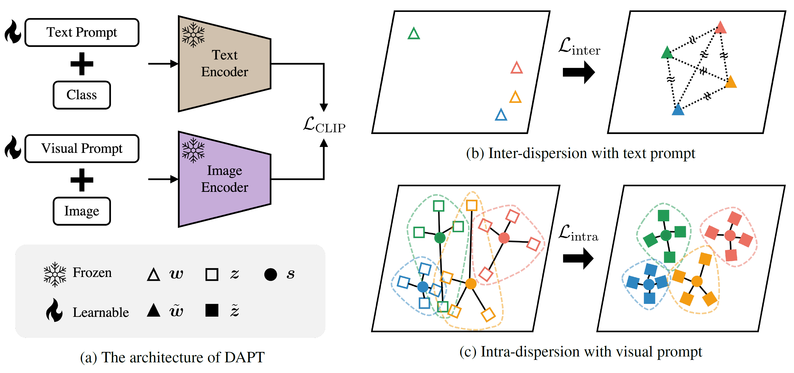

# Distribution-Aware Prompt Tuning for Vision-Language Models
Official pytorch implementation of "[Distribution-Aware Prompt Tuning for Vision-Language Models](https://openaccess.thecvf.com/content/ICCV2023/papers/Cho_Distribution-Aware_Prompt_Tuning_for_Vision-Language_Models_ICCV_2023_paper.pdf)" (ICCV 2023).
<div align="center">
  
</div>

## Setup
### Clone repository
```
git clone https://github.com/mlvlab/DAPT.git
cd DAPT
```

### Prepare dataset
Follow [DATASET.md](DATASET.md) to install the datasets.

### Setup conda environment
Before creating the environment, you should modify appropriate conda path in `env.yaml`

```
conda env create —-file env.yaml
conda activate dapt
pip install torch==1.10.0+cu111 torchvision==0.11.0+cu111 torchaudio==0.10.0 -f https://download.pytorch.org/whl/torch_stable.html
```

### Setup [Dassl.pytorch](https://github.com/KaiyangZhou/Dassl.pytorch) package
```
cd Dassl.pytorch
python setup.py develop
cd ..
```

## Run
### Dataset path setting
Modify the data path `$DATA` in `main.sh`, `gen_prototype.sh`, and `eval.sh` to match the path to the dataset you downloaded.

### Generate prototype
When the dataset is ready, you can generate the prototype as follows.

```
bash scripts/gen_prototype.sh [gpu_id]
```

### Few-shot image classification
Below is an example of Caltech101 for each shot.

Note that for ImageNet, we use `configs/trainers/DAPT/vit_b16_ep50.yaml` for all settings following [CoOp](https://arxiv.org/abs/2109.01134).

```
# 1shot
bash scripts/main.sh caltech101 1 [gpu_id]
# 2shots
bash scripts/main.sh caltech101 2 [gpu_id]
# 4shots
bash scripts/main.sh caltech101 4 [gpu_id]
# 8shots
bash scripts/main.sh caltech101 8 [gpu_id]
# 16shots
bash scripts/main.sh caltech101 16 [gpu_id]
```

### Domain generalization
Before domain generalization, you should completed few-shot image classification on ImageNet.

After the few-shot image classification experiment on ImageNet is finished, you can load the model learned on ImageNet using `--eval-only` command to conduct domain generalization on `imagenetv2`, `imagenet-sketch`, `imagenet-a`, and `imagenet-r`.
```
bash scripts/eval.sh [gpu_id]
```

## Acknowledgement
This repository is built upon [Dassl.pytorch](https://github.com/KaiyangZhou/Dassl.pytorch), [CoOp](https://github.com/KaiyangZhou/CoOp), and [VPT](https://github.com/KMnP/vpt). We thank the authors for their code.

## Citation
If you use this code in your research, please kindly cite the following paper:
```
@InProceedings{Cho_2023_ICCV,
    author    = {Cho, Eulrang and Kim, Jooyeon and Kim, Hyunwoo J},
    title     = {Distribution-Aware Prompt Tuning for Vision-Language Models},
    booktitle = {Proceedings of the IEEE/CVF International Conference on Computer Vision (ICCV)},
    month     = {October},
    year      = {2023},
    pages     = {22004-22013}
}
```

## License
Licensed under [MIT License](https://github.com/mlvlab/DAPT/blob/master/LICENSE)
> Copyright (c) 2023 MLV Lab (Machine Learning and Vision Lab at Korea University)
